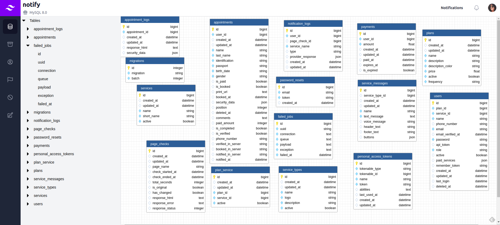

# Laravel database UI designer and model generator

[](https://packagist.org/packages/roberto910907/laravel-database-designer)
[](https://github.com/roberto910907/laravel-database-designer/actions?query=workflow%3Arun-tests+branch%3Amain)
[](https://github.com/roberto910907/laravel-database-designer/actions?query=workflow%3A"Fix+PHP+code+style+issues"+branch%3Amain)
[](https://packagist.org/packages/roberto910907/laravel-database-designer)

This package aims to ease interaction with databases
when developing a Laravel application. The main goal is to automate
the models and migrations generation.



## Still in Development
Note: This package is in development :(

## TODO List
### Read actions are implemented first
- Adjust the database name and version based on the Abstract Platform(doctrine/dbal)
- Show table relationships
- Left panel search bar and table + column icons
- Tree Navigator and Designer section headers
- ERD actions(zoom in, zoom out, fit, reset, drop table, add relationship)
- Right panel with table and column information and config options
- Collapsed left panel with main menus including: Diagram, Migration, History, etc
- Migration menu should show executed and pending migrations
- Use the laravel-console-generator to create the model and migration automatically
- Write documentation
- Write unit, functional and E2E tests

## Installation

You can install the package via composer:

```bash
composer require roberto910907/laravel-database-designer
```

You can publish the config file with:

```bash
php artisan vendor:publish --tag="laravel-database-designer-config"
```

This is the contents of the published config file:

```php
return [
];
```

## Credits

- [Roberto Rielo](https://github.com/roberto910907)
